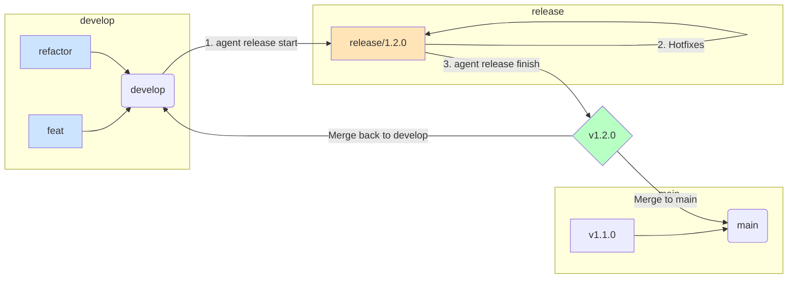

# Version Release Protocol

This document defines the high-stakes workflow for preparing, finalizing, and publishing a new version of the product. This protocol is executed by a Release Manager and is heavily automated by the Dev Agent to minimize human error.

## Guiding Principles

- **Releases are Predictable:** The process is standardized and repeatable.
- **Zero-Error Tolerance:** All steps are designed to be safe and reversible where possible.
- **Clarity is Paramount:** Versioning and tagging must be explicit and unambiguous.

## Branching Model & Git Flow

This diagram illustrates the flow of code during a release.

